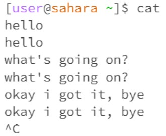

# Lab Report 1
# A Blog post about commands `cd`, `ls`, and `cat`

## 1. cd
 
- ### No argument
  

The current directory is `/lecture1/`. 

As we call command `cd`, the terminal goes to its home directory, which is `/home`.

This is not an error.

- ### Directory
  

The working directory is `/home`. 

As we call command `cd lecture1/`, the terminal goes to directory `/home/lecture1/`.

This is not an error.

- ### Filename
- 

The working directory is `/home`.

As command is called, the terminal prints out an error message, informing the user that en-us.txt is not a directory

`cd` command with filename produces an error.

## 2. ls

- ### No argument
  

The working directory is `/home`. 

`ls` without argument prints out the list of files in the current working directory.

This is not an error.

- ### Directory
  

The working directory is `/home`.

The command `ls lecture1/` accesses the `lecture1/` directory within working directory, and prints out the list of files in `/home/lecture1/` directory.

Command does not produce errors. Unless the argument is a relative path, and that path does not exist within working directory.

- ### Filename
  

The working directory is `/home`.

Command repeat the argument file path

This command does not produce erros.

In case the file does not exist, `ls` will printout an error message informing the user that there’s no such file or directory

## 3. cat

- ### No argument

The working directory is `/home`.

The `cat` command without argument will read data from input and print them to its standard output.

The command does not produce errors.

- ### Directory

The working directory is `/home`.

The terminal informs user that `lecture1/` is a directory, there's nothing to print out for output.

This is an error. 

- ### Filename

The working directory is `/home`.

The terminal prints out the content of the file in form of text

This is not an error.
