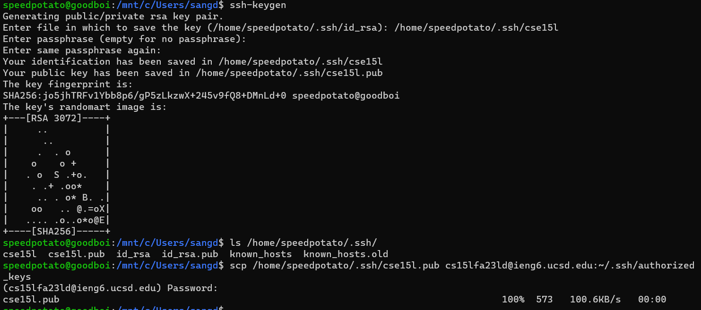
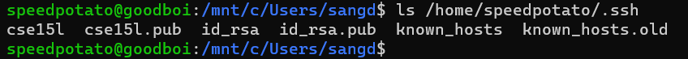
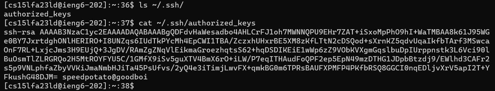
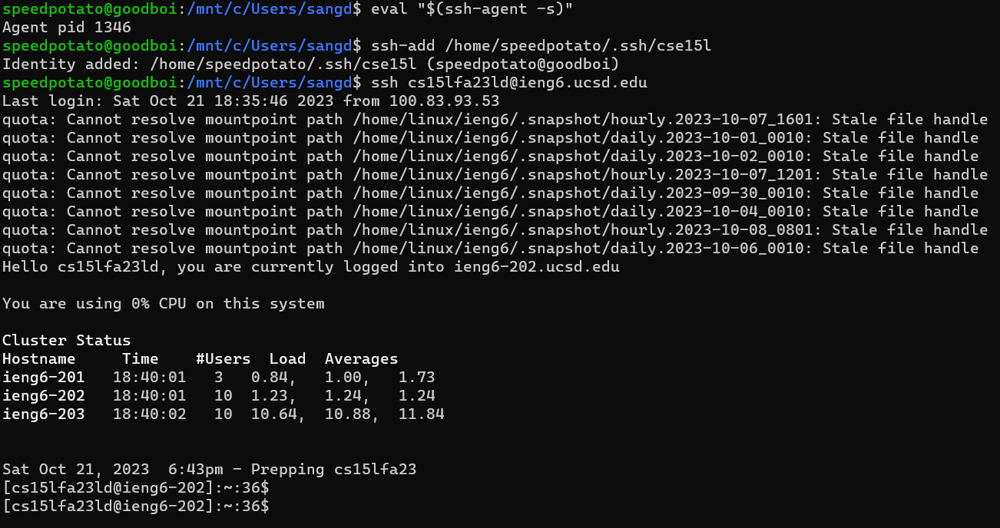

# Lab 2 Report

## Part 1

Code for `StringServer`

### First ScreenShot

Method `handleRequest(URI url)` was called to process the url.

After getting the path, `url.getPath().contains("/add-message"))` checks to see if the path contain `add-message`. If `True`, `url.getQuery()` is called to get the query `s=??!!`, then it is spitted into `parameter[0]=s` and `parameter[1]="??!!`.

Because the query key is `s`, `num` is incremented, and `txt` is concatenated with new string `num parameter[1] \n`

### Second Screenshot

### Invalid argument

## Part 2

### Path to the private key and public key on my computer

### Path to the public key for my SSH key (within my account on `ieng6`)

For this screenshot, I also `cat` to see the content of `cse15l.pub` file

### Logging into `ieng6` without being asked password

After generating new SSH key, I have to use command `ssh-add` to add this new key to SSH agent, so my identity is recognized

## Part 3

