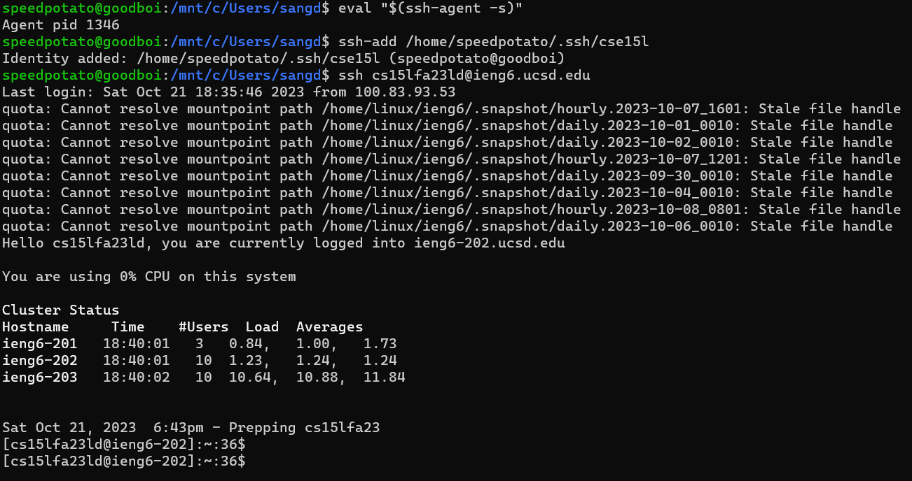

# Lab 2 Report

## Part 1

Code for `StringServer`

### First ScreenShot

Method `handleRequest(URI url)` was called to process the url.

After getting the path, `url.getPath().contains("/add-message"))` checks to see if the path contain `add-message`. If `True`, `url.getQuery()` is called to get the query `s=??!!`, then it is splitted into `parameters[0]=s` and `parameters[1]="??!!`.

Because the query key is `s`, `num` is incremented, and `txt` is concatenated with new string `num parameters[1]\n`

### Second Screenshot

Similar to first screenshot, we got `/add-message` as a path, so we check for the query. Query is `s=%20000`, it is splitted into `parameters[0]=s` and `parameters[1]="%20000"`. 

Because the query key is `s`, `num` is incremented, and `txt` is concatenated with new string `num parameters[1]\n`

### As shown in both screenshots,
The methods called in my code includes:
1. getPath.contains(String arg), relevant argument values are `/` or `/add-message`. If not those two, the function does nothing and returns `404 Not Found`
2. getQuery() which seeks for contents after `?`. The query key must be `s`, and the value can be `String`, `int`, `double`, `URI`... as long as they can be converted to `String`.
3. As shown in the Invalid argument screenshot below, the query value contains `#` as first letter, the method `getQuery()` does not catch the rest, and we get `ArrayIndexOutofBoundsException` because `parameters[1]` is `null`.

### Invalid argument

## Part 2

### Path to the private key and public key on my computer
Both `cse15l` private key and `cse15l.pub` public key in my computer are stored in `/home/speedpotato/.shh`

### Path to the public key for my SSH key (within my account on `ieng6`)

Path to public key on `ieng6` is `/home/.ssh`

For this screenshot, I also `cat` to see the content of `cse15l.pub` file

### Logging into `ieng6` without being asked password

After generating new SSH key, I had to use command `ssh-add` to add this new key to SSH agent, so my identity is recognized

## Part 3

I used `ssh` before for Github, but I didn't really understand the mechanism of it. By practicing using the command `scp`, I have a more fundamental ideas about how remote server use public key, and how my local computer use private key to verify my identity. The code for Java server is also new to me, now I (kinda) know how the server repond as they process the paths and queries.

