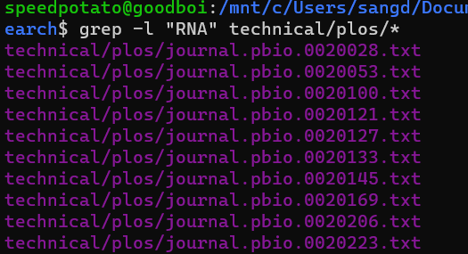
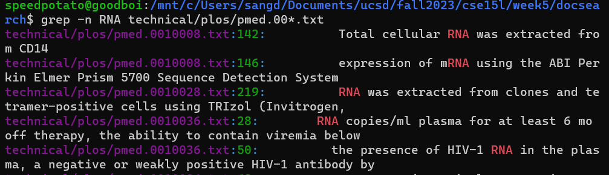
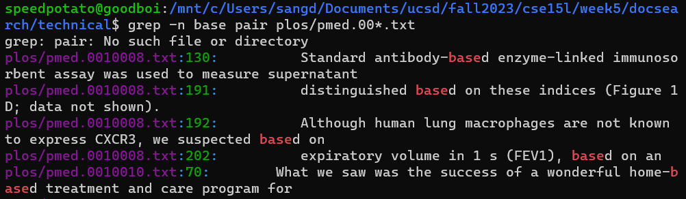
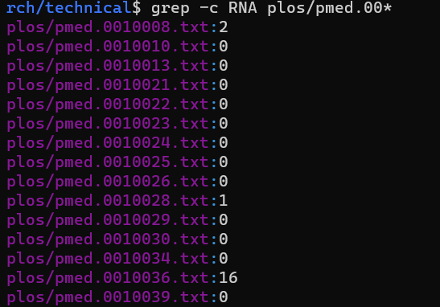
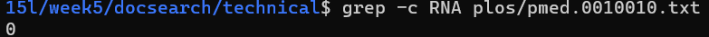

# Lab 3 Report

## Part 1 - Bugs

Chosen bugs: ArrayTests - testReverseInPlace(Array)

### 1. A failure-inducing input for the buggy program, as a JUnit test and any associated code (write it as a code block in Markdown)
```
	@Test 
	public void SDtestReverseInPlace() {
    int[] input1 = {1,2,3,4};
    ArrayExamples.reverseInPlace(input1);
    assertArrayEquals(new int[]{4,3,2,1}, input1);
	}
```

### 2. An input that doesn’t induce a failure, as a JUnit test and any associated code (write it as a code block in Markdown)
```
	@Test 
	public void testReverseInPlace() {
    int[] input1 = { 3 };
    ArrayExamples.reverseInPlace(input1);
    assertArrayEquals(new int[]{ 3 }, input1);
	}
```

### 3. The symptom, as the output of running the tests (provide it as a screenshot of running JUnit with at least the two inputs above)


### 4. The bug, as the before-and-after code change required to fix it (as two code blocks in Markdown)

Before: 

```
  // Changes the input array to be in reversed order
  static void reverseInPlace(int[] arr) {
    for(int i = 0; i < arr.length; i += 1) {
      arr[i] = arr[arr.length - i - 1];
    }
  }
```

After: 

```
  // Changes the input array to be in reversed order
  static void reverseInPlace(int[] arr) {
    for(int i = 0; i < arr.length/2; i += 1) { //change
      int temp = arr[i];    //change
      arr[i] = arr[arr.length - i - 1];
      arr[arr.length - i - 1] = temp; //change
    }
  }
```

### Briefly describe why the fix addresses the issue: 
The `before` function iterates through the whole array, it directly assigns `arr[i]` with `arr[arr.length - i - 1]`, so when `i` gets to `arr.length/2`, the first of of the array will be identical in-reversed to the last half. 

To fix this, `after` function interate through `arr.length/2`, it creates variable `temp` to store value of `arr[i]`, then swap `arr[i]` with `arr[arr.length - i - 1]`l

## Part 2 - Research Commands

Chosen command: `grep`

Source: Google Bard, because ChatGPT is already too popular

Here are 4 grep command-line options:

* **-i** (ignore case): This option tells `grep`` to ignore case distinctions when matching patterns. For example, the following command will match both "rna" and "RNA":

```
grep -i "RNA" technical/plos/*
```


```
grep -i Intern technical/plos/*
```


* **-l** (list filenames only): This option tells grep to only print the filenames of files that contain matches, rather than printing the matching lines themselves. For example, the following command will print a list of all files in the current directory that contain the word "rna" (example 1) and "RNA" (example 2):

```
grep -l rna technical/plos/* .
```


```
grep -l "RNA" technical/plos/*
```



* **-n** (print line numbers): This option tells grep to print the line numbers of all matching lines. For example, the following command will print the line numbers of all lines in the files "pmed.00*.txt" that contain the word "RNA" (example 1) and "base" (example 2):

```
grep -n RNA technical/plos/pmed.00*.txt
```


```
grep -n base pair plos/pmed.00*.txt
```


* **-c** (count matches): This option tells grep to count the number of lines that match the pattern, rather than printing the matching lines themselves. For example, the following command will print the number of lines in the files that contain the word "RNA" (example 1).

```
grep -c RNA plos/pmed.00*.txt
```


example 2, one file
```
grep -c RNA plos/pmed.0010010.txt
```


These are just a few of the many grep command-line options that are available. For more information, please see the grep man page.

Here is an example of how to use grep with multiple options. This command print out the line number of files (using `-n`) that contain "RNA", "rna"... (using `-i`)

```
grep -i -n RNA plos/pmed.00*
```
