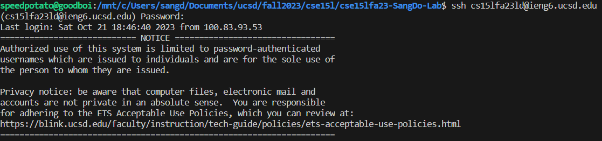
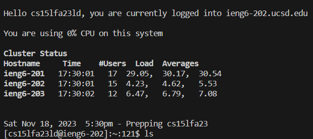
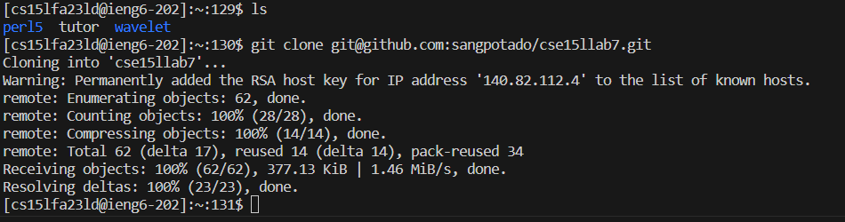
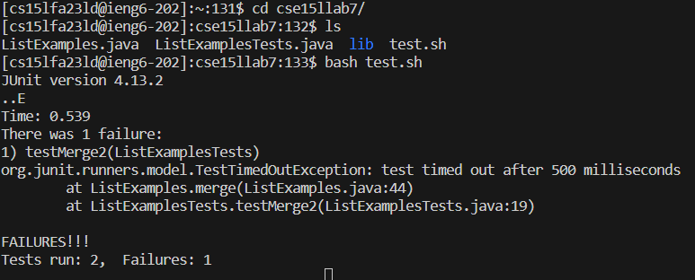
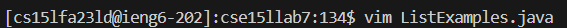
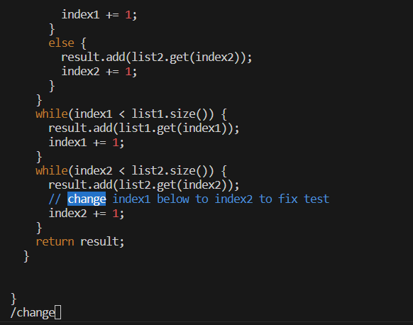
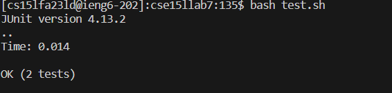
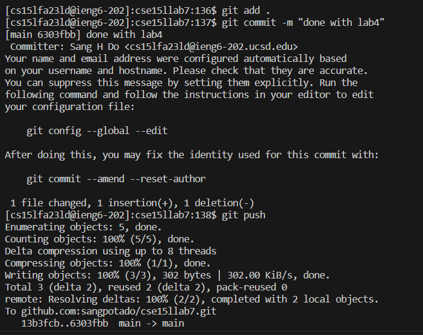

# Lab 4 Report

## step 4: Log into ieng6

Command: `ssh cse15lfa23ld@ieng6.ucsd.edu <enter>`

## step 5: Clone your fork of the repository from your Github account (using the SSH URL)

copy the SSH URL from github website

`git clone <ctrl>v`

`<ctrl>v` paste the coppied URL into my terminal

## step 6: Run the tests, demonstrating that they fail

I used `<tab>` so the terminal can help me finish the words instead of typing them all out by myself

`cd cs<tab><enter>` --> going into the lab folder

`ls` --> list out the files, because I don't remember exactly the file names

`bash t<tab><enter>` --> run `bash test.sh`

## step 7: Edit the code file to fix the failing test

Command `vim L<tab>.ja<tab><enter>` --> call `vim` to edit file, there're 2 files whose names contain `ListExample`, so first `<tab>` stopped 
there, I continued with the name `.ja` and let the 2nd `<tab>` finish.

Once inside `vim`, I typed: 

`/change<enter><down><right><right>r2<esc>:wq<enter>`

`/change` --> search for the word "change"

`<enter>` --> to stop searching, alternatively, I could press `<esc>` 

`<down><right><right>`--> move to the character I want to change, which is '1' of "index1"

`r2` --> replace '1' with '2'

`<esc>:wq<enter>` --> escape replace mode, then write and quit

## step 8: Run the tests, demonstrating that they now succeed

`<up><up><enter>` --> `bash test.sh` is up 2 in the history

## step 9: Commit and push the resulting change to your Github account (you can pick any commit message!)

`git add .` --> stage all the files which were changed

`git commit -m "done with lab4"`  --> commit the change with the message

`git push` --> push the change to Github server

