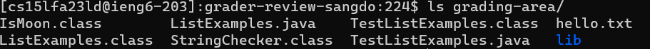

# Lab 5 Report

## Part 1 – Debugging Scenario
Design a debugging scenario, and write your report as a conversation on EdStem. It should have:

### 1. The original post from a student with a screenshot showing a symptom and a description of a guess at the bug/some sense of what the failure-inducing input is. (Don’t actually make the post! Just write the content that would go in such a post)

Screenshot of failure. The `ListsExamples.merge` method got timeout error for both inputs:


The inputs look legit, so I guess it's the method that is wrong. 

Input:


Method:


### 2. A response from a TA asking a leading question or suggesting a command to try (To be clear, you are mimicking a TA here.)

Looking at the input, both tests seem fine. I think you're going in the right direction about investigating the method. The inputs are short, we shouldn't get a timeout error. I suspect that the method ran into infinite loop. We may want to take a closer look at how the method ran the loop and how the loop is terminated. If we can't figure it out, we can use `jdb` to get an even closer look at the variables.

### 3. Another screenshot/terminal output showing what information the student got from trying that, and a clear description of what the bug is.

Accessing the `ListExample.java` file


The bug that causes the method to run in an infinite loop is in the last while loop. The variable index1 is mistakenly incremented instead of index2. As a result, index2 never reaches the end of list2, and the loop continues indefinitely, causing the method to run in an infinite loop. The correct line should be index2 += 1; to properly advance through list2.

Make change so the method increment the right index:

Before: 

After: 

Result: it works: 

### 4. At the end, all the information needed about the setup including:

The file & directory structure needed: 

Once the command `bash grade.sh https://github.com/sangpotado/lab5bugscenario`is called, files are downloaded, coppied, and copiled within `grading-area folder`: 

The contents of each file before fixing the bug: shown in part 1 and 3

The full command line (or lines) you ran to trigger the bug: . These lines are in `grade.sh` script

A description of what to edit to fix the bug: As shown in step 3, I used `vim` to access and edit the code. 

I then access git repository `https://github.com/sangpotado/lab5bugscenario`, edit the code, and run these commands:
```
git add .
git commit -m "fix bug"
git push
```
to make the change to the repository

## Part 2: Reflection

I only know `git` and some Linux terminal commands before this quarter. Now, I have a better understanding about `ssh` and `bash`. I got more comfortable working with remote server now, given that my terminal commands vocabs has increased. Java is not my go-to programming language, but learning about java's server, jdb, process is cool.