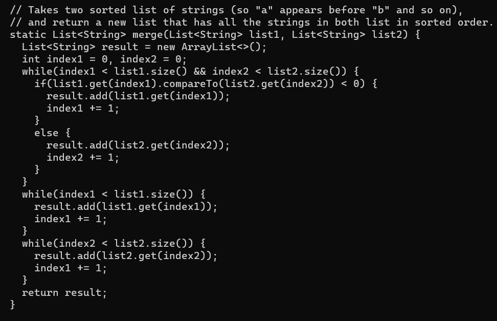

# Lab 5 Report

##Part 1 – Debugging Scenario
Design a debugging scenario, and write your report as a conversation on EdStem. It should have:

### 1. The original post from a student with a screenshot showing a symptom and a description of a guess at the bug/some sense of what the failure-inducing input is. (Don’t actually make the post! Just write the content that would go in such a post)

Screenshots of failure. The `ListsExamples.merge` method got timeout error for both inputs:

The inputs look legit, so I guess it's the method that is wrong. 

Input:

Method:

### 2. A response from a TA asking a leading question or suggesting a command to try (To be clear, you are mimicking a TA here.)

A
### 3. Another screenshot/terminal output showing what information the student got from trying that, and a clear description of what the bug is.

### 4. At the end, all the information needed about the setup including:
The file & directory structure needed
The contents of each file before fixing the bug
The full command line (or lines) you ran to trigger the bug
A description of what to edit to fix the bug