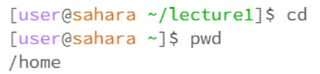
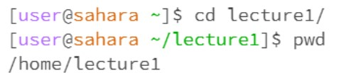
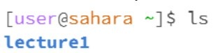
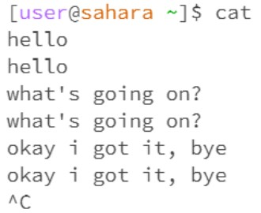
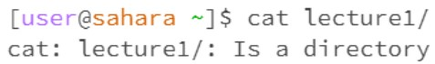
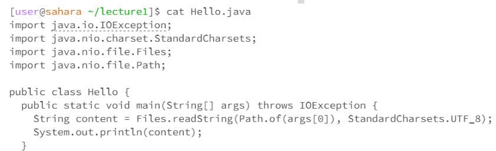

# Lab Report 1
# A Blog post about commands `cd`, `ls`, and `cat`

1. ## cd
- ### No argument

The current directory is `/lecture1/`. As we call command `cd`, the terminal goes to its home directory, which is `/home`

- ### Directory

The working directory was `/home`. As call command `cd lecture1/`, the terminal goes to directory `/home/lecture1/`

- ### Filename

Terminal print out an error message, informing the user that en-us.txt is not a directory

2. ## ls
- ### No argument

The current directory is `/home`. `ls` without argument prints out the list of files in the current directory

- ### Directory

The command prints out the list of files in the argument directory

- ### Filename

Command repeat the argument file path

In case the file does not exist, `ls` will printout an error message informing the user that there’s no such file or directory

3. ## cat
- ### No argument

The terminal runs a program, beside repeating whatever the user types in, I’m not sure whatelse it does

- ### Directory

The terminal informs user that `lecture1/` is a directory, there's nothing to print out

- ### Filename

The terminal prints out the content of the file in form of text
